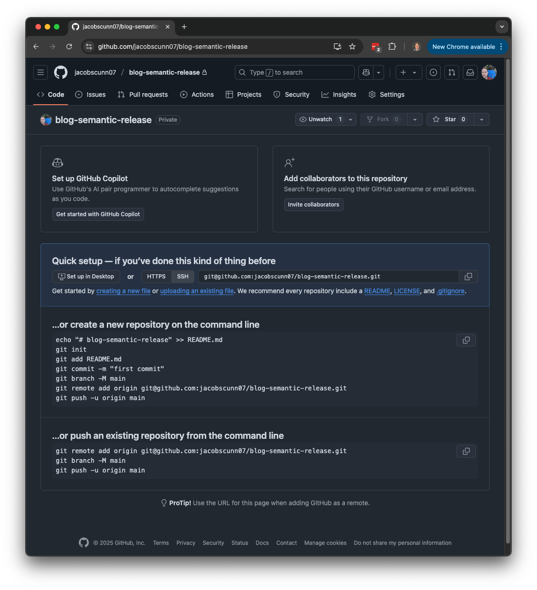
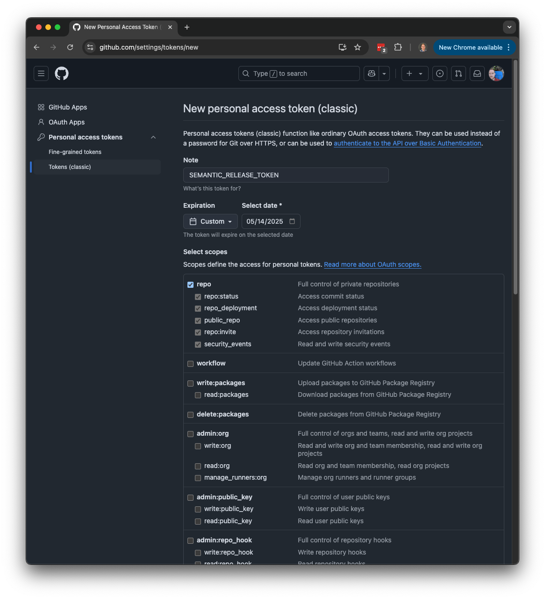
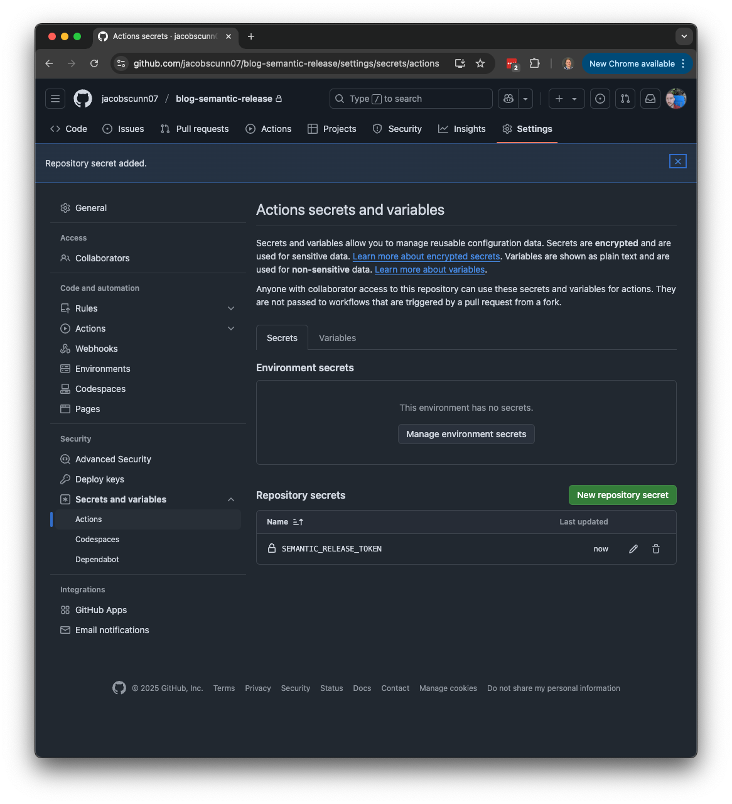
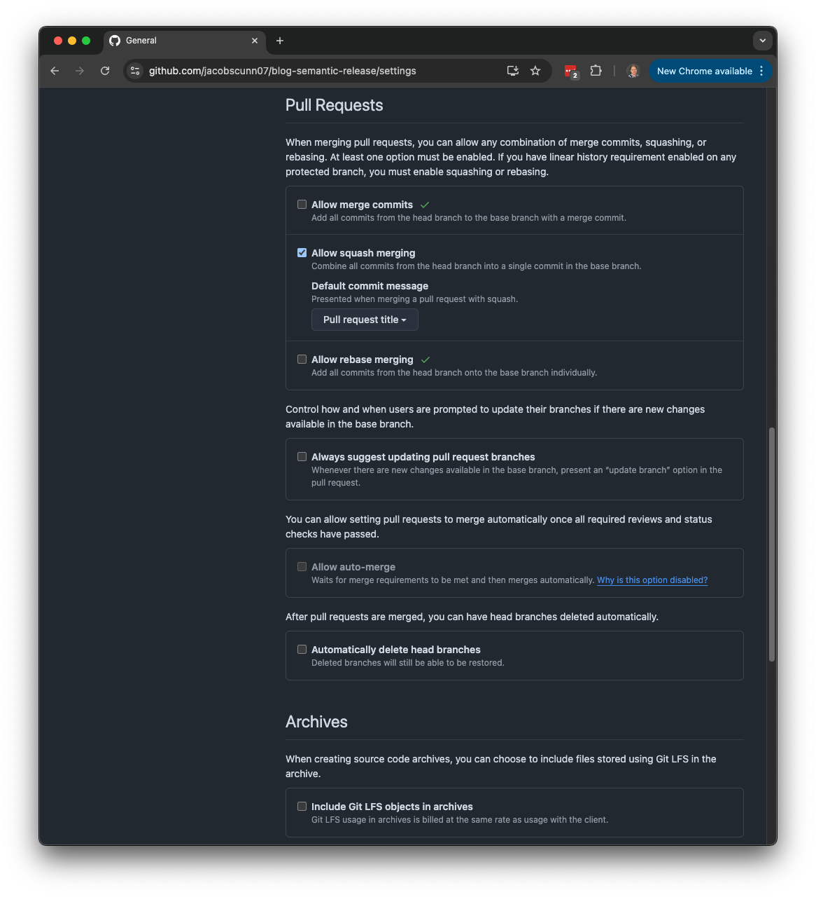
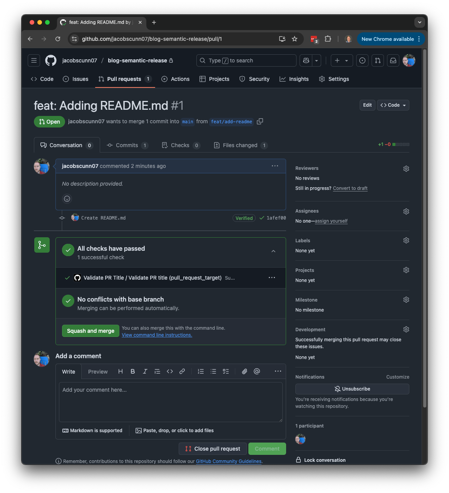
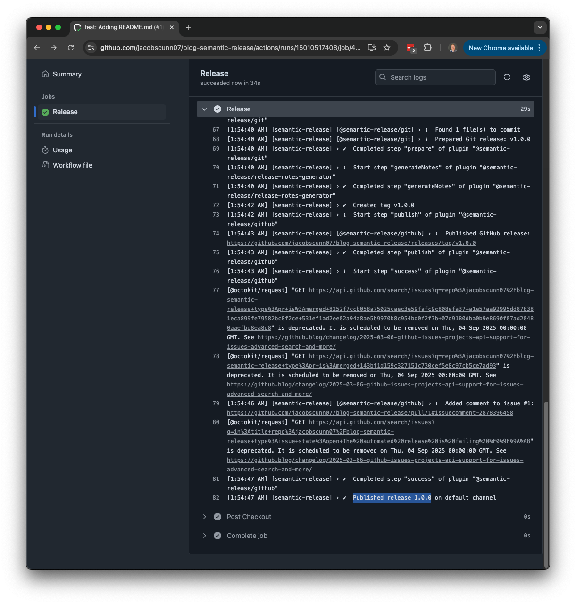
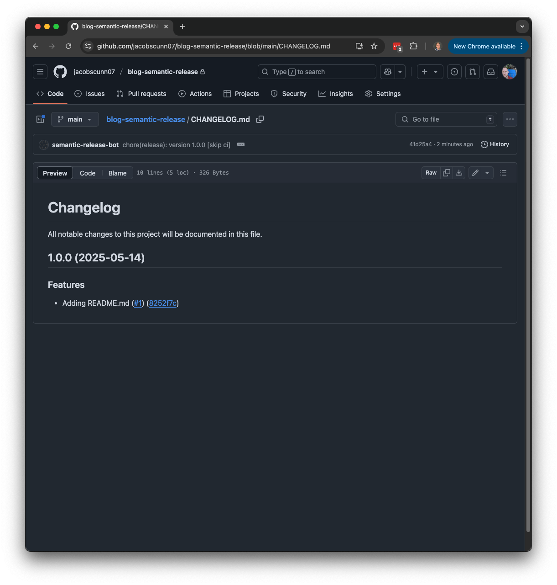
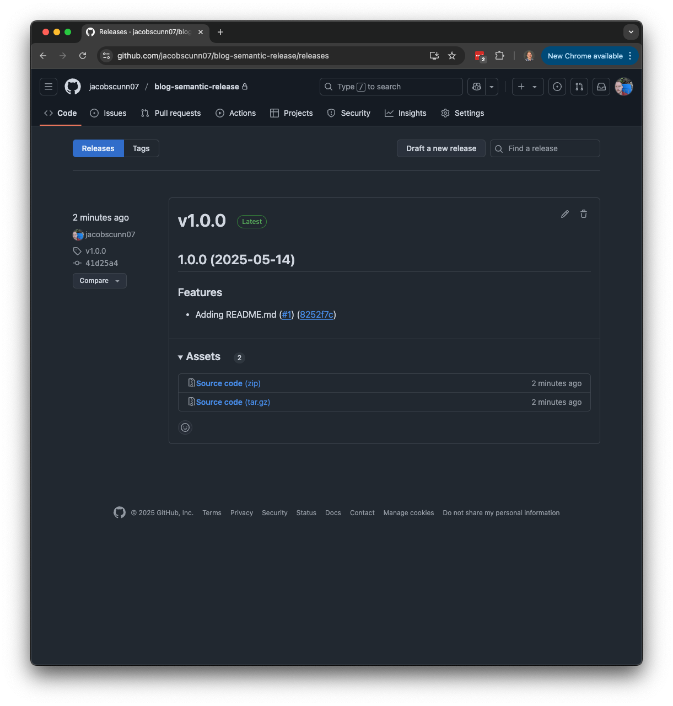

+++
date = '2025-05-14T00:00:00-05:00'
title = 'Versioning Software Artifacts at the Speed of git commit'
slug = "semantic-versioning-with-semantic-release"
tags = ["cicd"]
+++

Versioning software has been a long debated topic. Should this be an automated process? Is it even worth automating, or is manually creating versions fine? If we do automate it, what is the naming convention? Should it be be based on time, the CI system build number, the git short sha, semantic versioning, or maybe something else?

I think we can all agree that yes, we should be versioning our software artifacts. We can also agree that ideally we should be using semantic versioning. 

### Semantic Versioning

Semantic versioning is ideal because it is easy for us humans to understand. I can compare two semantic versions and determine which one is newer, if the newer one will have a breaking change, or if the new version contains new features or just fixes to existing features.

#### Semantic Version Format

The below is the specification of a semantic version. It contains information about the `major`, `minor`, and `patch` versions. It can include other parts such as prerelease and build metadata, but I have never needed to use those parts of the specification when versioning internal software for my organization.

```text
<major>.<minor>.<patch>
```

__Major__ - A breaking change has occurred to an existing feature. This could be due to a change in a contract or the functionality of a feature has changed.

__Minor__ - A new feature has been introduced.

__Patch__ - A fix to an existing feature has been triaged.

Now that we undertand the components of a semantic version, the next question that pops up is how can we automate the selection of incrementing the major, minor, or patch for the next release? To be able to achieve this in an automatic fashion, we need to establish a contract that we will adhere to. This contract will be an agreement between human and machine, so that we can communicate with the automation system as to which segment of the semantic version should be incremented. The contract that we will be adhering to is called __Conventional Commits__.

### Conventional Commits

[Conventional Commits](https://www.conventionalcommits.org/en/v1.0.0/) is the specification, or contract, for writing human readable commits that can be interpretted by machines. Because of this, it is the perfect contract for us to instruct the automation system of which semantic version segment to be incremented.

I strongly recommend that you review the official documentation for this specification. I will not be reiterating it here in full, but essentially the specification states that all git commit messages should be in the form of:

```text
<type>(<scope>): <message or description>
```

In this format, there are three placeholders __type__, __scope__, and the __message or description__.

__type__

The overall type of change this git commit contains. This is what determines if the next semantic version should increment the major, minor, or patch version. There are a few types that we can use.
* feat
* fix
* docs
* ci
* chore

__scope__

The scope is the area of the codebase that is being modified in someway in this git commit. Remember, it is a development best practice to make small changes and integrate those changes often into the main branch. This is an optional field, so it can be omitted. If you are working on a distributed system, it is likely not necessary. If this repository is for a modular monolith, it will probably be helpful to include the scope.

__Message or description__

The message or description that describes what changes were made. 

:warning: In our final solution, this message will be visible in a `CHANGELOG.md` file as well as on the releases page on the GitHub repository. Therefore, it is important to make this message meaningful for our future selves.

#### Examples

##### Example 1: Breaking change

The below is a breaking change to an existing feature and will result in bumping the __major__ version.

```shell
git commit -m 'feat!: This is a breaking change to an existing feature'
```

:warning: Note the exclamation mark after `feat`. This signifies there is a breaking change to an existing feature.

##### Example 2: New feature

The below is a new feature and will result in bumping the __minor__ version.

```shell
git commit -m 'feat: This is a new feature'
```

##### Example 3: Bug fix to an existing feature

The below is a bug fix to an existing feature and will result in bumping the __patch__ version.

```shell
git commit -m 'fix: This is a bug fix to an existing feature'
```

So now we know that we want to version our software artifacts using the semantic versioning specification and how we can communicate what the next version should be using conventional commits, but how can we create a release each time merge a pull request? That, my friends, is where Semantic Release comes into play.

### Semantic Release

[Semantic Release](https://semantic-release.gitbook.io/semantic-release) is the tool that will interpret these conventional commits and determine what the next semantic version should be, build the artifacts, and push said artifacts to the artifact repository with this version.

#### Implementing A Semantic Release Workflow

#### Prerequisites

##### GitHub Repository

A private __GitHub Repository__. It does not necessarily need to be private, but for this implementation we will be working under the assumption that we are building and versioning software internal to our organization. This is likely the scenario for most of us.



##### GitHub Personal Access Token

A __GitHub Personal Access Token__ (PAT) with `repo` access. We will need a PAT with `repo` access so that we have write access to our repository. 



We will need to be able to create new releases in github for our version, push the tag for our version, and optionally create a `CHANGELOG.MD` file as a nice bit of documentation.

Add this PAT as a repository secret named `SEMANTIC_RELEASE_TOKEN`.



##### GitHub Repository Collaborators

If you created the GitHub PAT under a service account user, be sure that this user is a collaborator with write access on this repository.

I know I've been burned a few times giving my PAT permissions, but not did not configure permissions on the repository itself.

<!--  -->

##### Configure Pull Request Commit Messages

To help dummy proof the process of naming our pull request titles in the conventional commits specification, we need to enable `Allow squash merging` and updating the commit message configuration to being the `Pull request title`. This will ensure that a commit message exists that follows the conventional commit specification which will allow semantic release to properly determine the next semantic version.



#### Semantic Release Configuration

Before we can do anything with Semantic Release, we need to create a configuration file so that it will know how we want it to behave. 

For example, which branches it is allowed to be executed on and which plugins we want to use.

Create a file `.releaserc.json` at the root of your repository.

```json
{
  "branches": [
    "main",
    "master"
  ],
  "ci": false,
  "plugins": [
    [
      "@semantic-release/commit-analyzer",
      {
        "preset": "conventionalcommits"
      }
    ],
    [
      "@semantic-release/release-notes-generator",
      {
        "preset": "conventionalcommits"
      }
    ],
    [
      "@semantic-release/github",
      {
        "successComment": "This ${issue.pull_request ? 'PR is included' : 'issue has been resolved'} in version ${nextRelease.version} :tada:",
        "labels": false,
        "releasedLabels": false
      }
    ],
    [
      "@semantic-release/changelog",
      {
        "changelogFile": "CHANGELOG.md",
        "changelogTitle": "# Changelog\n\nAll notable changes to this project will be documented in this file."
      }
    ],
    [
      "@semantic-release/git",
      {
        "assets": [
          "CHANGELOG.md"
        ],
        "message": "chore(release): version ${nextRelease.version} [skip ci]\n\n${nextRelease.notes}"
      }
    ]
  ]
}
```

#### GitHub Actions Workflows

Now, to automate Semantic Release to be kicked off each time we merge a pull request to our main branch, we need to create two workflows.

##### Workflow #1: Validate PR Title

This workflow is technically optional, but I like to include it as it will prevent any issues with the conventional commit message. This workflow will validate that our pull request title is in the form of a conventional commit message. This workflow will fail the build if it is not preventing us from merging to the `main` branch.

Forgetting to write the commit messages in the form of a conventional commit can happen even to the most senior of engineers, so it is a nice precaution to have in place.

Create a file `./.github/workflows/pr-title.yaml` with the below content.

```yaml
name: 'Validate PR Title'

on:
  pull_request_target:
    types:
      - opened
      - edited
      - synchronize

jobs:
  main:
    name: Validate PR title
    runs-on: ubuntu-latest
    permissions:
      pull-requests: read
    steps:
      - uses: amannn/action-semantic-pull-request@v5
        env:
          GITHUB_TOKEN: ${{ secrets.GITHUB_TOKEN }}
        with:
          types: |
            fix
            feat
            docs
            ci
            chore
          requireScope: false
          subjectPattern: ^[A-Z].+$
          subjectPatternError: |
            The subject "{subject}" found in the pull request title "{title}"
            didn't match the configured pattern. Please ensure that the subject
            starts with an uppercase character.
          validateSingleCommit: false
```

##### Workflow #2: Release

Now, let's create the workflow that will create the new release when something is pushed to the `main` branch.

Create a file `./.github/workflows/release.yaml` with the below content.

```yaml
name: Release

on:
  push:
    branches:
      - main
  workflow_dispatch:

jobs:
  release:
    name: Release
    runs-on: ubuntu-latest
    permissions:
      contents: write
      issues: write
      pull-requests: write
    steps:
      - name: Checkout
        uses: actions/checkout@v4
        with:
          persist-credentials: false
          fetch-depth: 0

      - name: Release
        uses: cycjimmy/semantic-release-action@v4
        with:
          semantic_version: 23.0.2
          extra_plugins: |
            @semantic-release/changelog@6.0.3
            @semantic-release/git@10.0.1
            conventional-changelog-conventionalcommits@7.0.2
        env:
          GITHUB_TOKEN: ${{ secrets.SEMANTIC_RELEASE_TOKEN }}
```

#### Releasing Our First Version

Now, the fun part. Let's add or edit something in our repository and commit it to a feature branch with a conventional commit style commit message. 

For this example, I will simply be adding a `README.md` file to our repository.

```shell
git switch -c feat/add-readme
echo "# blog-semantic-release" >> README.md
git add README.md
git commit -m "feat: Adding README.md"
```

Now, let's open a pull request to the main branch. Don't forget, we need to write our pull request title as a convential commit message as well.

```shell
gh pr create --title "feat: Adding README.md"
```



We can see in the image above, that the `Validate PR Title` workflow ran successfully. Now, let's get this merged by doing a squash and merge.

Immediately after merging, we can see that our `Release` GitHub Actions Workflow has kicked off. If we look a bit closer at the logs of this workflow, we can see that the next semantic version was determined to be `1.0.0`.



If you navigate to the root of the repository, you will see a `CHANGELOG.md` that contains information about our release. You will also see the that each conventional commit style message is a bullet point in the file. We did a squash and merge when we merged our pull request, so we only see the pull request title.



We can also see our new release listed in the releases page of our git repository.



I would encourage you to make small tweaks to your repository and test out the different commit messages to trigger new major, minor, and patch releases.

```shell
gh pr create --title "feat!: This will create a new major version"
gh pr create --title "feat: This will create a new minor version"
gh pr create --title "fix: This will create a new patch version"
gh pr create --title "docs: This will not trigger a new version as we are only updating documentation"
gh pr create --title "ci: This will not trigger a new verion as we are only updating ci/cd components"
```

### Conclusion

And just like that, we are able to create new versions of our software that are versioned with the semantic versioning specification without too much of a hassle. It just took us to be a bit more disciplined in writing our git commit messages in the conventional commit format. By doing this, we are able to communicate with our automation system to create new releases and what version those releases should be with the help of the semantic release project.
